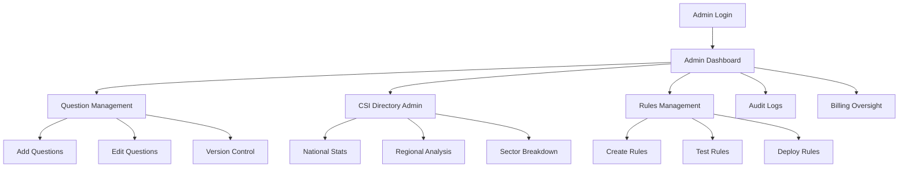
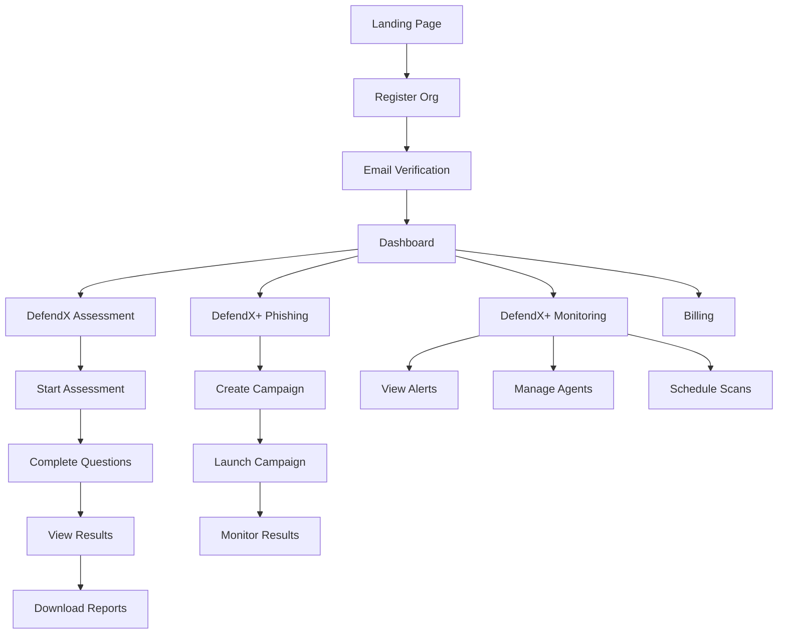
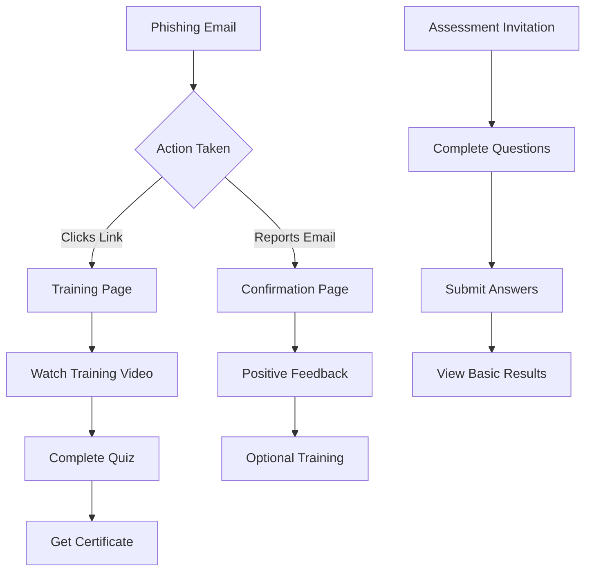

# CyberDefend 360 - User Flows Documentation

## Overview
This document outlines the complete user flows for all three user types in CyberDefend 360:
1. **Admin (CSA/Super Admin)** - System oversight and governance
2. **Organization Manager** - Main customers managing cybersecurity
3. **End-User (Employee)** - Staff participating in assessments and training

---

## 🔐 1. ADMIN USER FLOW (CSA/Super Admin)

### Role: `SUPER_ADMIN`, `CSA_ADMIN`
**Primary Goal:** System governance, question management, national cybersecurity oversight

### Authentication & Dashboard
```
/login → /dashboard/admin/overview
```

#### 1.1 Login Flow
- **Entry Point:** `/login`
- **API:** `POST /auth/login`
- **Credentials:** Admin-level email/password
- **Redirect:** `/dashboard/admin/overview`
- **Protected Route:** `allowedRoles: ['SUPER_ADMIN', 'CSA_ADMIN']`

#### 1.2 Admin Dashboard Overview
- **Route:** `/dashboard` (automatically shows AdminDashboard for admin roles)
- **Component:** `AdminDashboard`
- **Role-Based Access:** Automatically displayed for `SUPER_ADMIN` and `CSA_ADMIN`
- **APIs Called:**
  - `GET /admin/dashboard/stats` - System-wide statistics
  - `GET /admin/organizations` - Organization count/status
  - `GET /csi-directory/admin/stats` - National CSI statistics
- **Key Metrics Displayed:**
  - Total organizations registered
  - Active assessments running
  - National average CSI score
  - Regional performance breakdown
  - Recent system activity

### Question Management Flow
```
Admin Dashboard → Question Manager → Add/Edit/Delete Questions
```

#### 1.3 Assessment Question Management
- **Route:** `/dashboard/admin/questions`
- **Component:** `QuestionManager`
- **APIs Used:**
  - `GET /admin/questions` - Fetch all questions
  - `POST /admin/questions` - Create new question
  - `PUT /admin/questions/:id` - Update existing question
  - `DELETE /admin/questions/:id` - Remove question
- **Key Functions:**
  - **Add Questions:** Create new assessment questions with categories
  - **Edit Questions:** Modify existing questions and scoring
  - **Version Control:** Maintain question versions for historical assessments
  - **Category Management:** Organize questions by domains (Governance, Technology, etc.)
  - **Question Activation:** Enable/disable questions for new assessments

#### 1.4 Question Creation Workflow
```
Question Manager → "Add Question" → 
Form: {
  text: string,
  category: 'governance' | 'technology' | 'people' | 'processes',
  type: 'multiple_choice' | 'rating' | 'yes_no',
  options: string[],
  scoring: {
    weights: number[],
    maxScore: number
  },
  isActive: boolean
}
→ Submit → API Call → Refresh List
```

### CSI Directory Management
```
Admin Dashboard → CSI Directory Admin → National Statistics
```

#### 1.5 National CSI Directory Oversight
- **Route:** `/dashboard/admin/csi-directory` (To be implemented)
- **APIs Used:**
  - `GET /csi-directory/admin/stats` - National CSI statistics
  - `GET /defendx/stats/regional` - Regional performance
  - `GET /defendx/stats/sectoral` - Sector-based analysis
- **Key Functions:**
  - **National Dashboard:** View Ghana's overall cybersecurity readiness
  - **Regional Analysis:** Compare CSI scores across regions
  - **Sector Analysis:** Track performance by industry (Banking, Healthcare, etc.)
  - **Leaderboard Management:** Approve organization visibility in public directory
  - **Compliance Monitoring:** Track organizations meeting national standards

### Alert Rules Management (DefendX+)
```
Admin Dashboard → Rules Management → Create/Edit Detection Rules
```

#### 1.6 Security Rules Administration
- **Route:** `/dashboard/admin/rules` (To be implemented)
- **APIs Used:**
  - `GET /defendxplus/rules` - Fetch all detection rules
  - `POST /defendxplus/rules` - Create new rule
  - `PUT /defendxplus/rules/:id` - Update rule
  - `POST /defendxplus/rules/test` - Test rule configuration
- **Key Functions:**
  - **Rule Creation:** Define new detection patterns
  - **Rule Testing:** Validate rules before deployment
  - **Global Deployment:** Push rules to all organizations
  - **Rule Versioning:** Maintain rule history and rollback capability

### Audit & Compliance
```
Admin Dashboard → Audit Logs → System Activity Review
```

#### 1.7 System Audit Trail
- **Route:** `/dashboard/admin/audit` (To be implemented)
- **APIs Used:**
  - `GET /admin/audit-logs` - System activity logs
  - `GET /admin/audit-logs/export` - Export audit data
- **Key Functions:**
  - **Activity Monitoring:** Track all system actions
  - **User Activity:** Monitor admin and organization actions
  - **Compliance Reporting:** Generate audit reports
  - **Security Events:** Track login attempts, permission changes

### Billing Oversight (Finance Role)
```
Admin Dashboard → Billing Overview → Organization Subscriptions
```

#### 1.8 Financial Administration
- **Route:** `/dashboard/admin/billing` (To be implemented)
- **APIs Used:**
  - `GET /admin/billing/overview` - Revenue statistics
  - `GET /admin/billing/organizations` - Organization billing status
  - `GET /billing/invoices/all` - All system invoices
- **Key Functions:**
  - **Revenue Tracking:** Monitor subscription revenue
  - **Organization Status:** View payment status of all orgs
  - **Invoice Management:** Handle billing disputes
  - **Plan Analytics:** Track plan popularity and usage

---

## 🏢 2. ORGANIZATION MANAGER USER FLOW

### Role: `ORG_ADMIN`, `ORG_MANAGER`
**Primary Goal:** Manage organizational cybersecurity posture and monitoring

### Authentication & Onboarding
```
Landing Page → Register → Email Verification → Dashboard
```

#### 2.1 Organization Registration
- **Entry Point:** `/` (Landing Page)
- **Flow:** Landing → `/register` → Email Verification → `/dashboard`
- **API:** `POST /auth/register`
- **Registration Data:**
  ```typescript
  {
    firstName: string,
    lastName: string,
    email: string,
    password: string,
    phone?: string,
    role: 'ORG_ADMIN' | 'ORG_MANAGER' | 'END_USER' | 'CSA_ADMIN'
  }
  ```
- **Role Selection:**
  - **Organization Administrator:** Full access to organization settings and billing
  - **Organization Manager:** Assessment and monitoring tools access  
  - **End User/Employee:** Basic assessment participation
  - **CSA Administrator:** System administration (CSA staff only)

#### 2.2 Dashboard Overview
- **Route:** `/dashboard` (automatically shows OrganizationManagerDashboard)
- **Component:** `OrganizationManagerDashboard`
- **Role-Based Access:** Automatically displayed for `ORG_ADMIN` and `ORG_MANAGER`
- **Key Sections:**
  - **CSI Score & Assessment Status:** Current cybersecurity index and latest assessment results
  - **Phishing Campaign Stats:** Active campaigns and success rates
  - **Security Monitoring:** Active alerts and endpoint status
  - **Quick Actions:** Fast access to start assessment, create campaigns, view reports
  - **Subscription Status:** Current plan and renewal information

### DefendX Assessment Flow
```
Dashboard → DefendX → Start Assessment → Questionnaire → Results → Reports
```

#### 2.3 Cybersecurity Assessment (CSI)
**Route Flow:**
```
/dashboard → /dashboard/defendx → /dashboard/defendx/assessment/start → /dashboard/defendx/assessment/result/:id
```

**API Flow:**
```
1. GET /defendx/assessments - View past assessments
2. POST /defendx/csi/start - Initialize new assessment
3. POST /defendx/csi/submit - Submit answers
4. GET /defendx/csi/result/:id - View results
```

#### 2.4 Assessment Process
- **Component:** `StartAssessment`
- **Questionnaire Features:**
  - **Dynamic Questions:** Loaded from admin-configured question bank
  - **Categories:** Governance, Technology, People, Processes
  - **Progress Tracking:** Save progress, resume later
  - **Scoring:** Real-time score calculation
  - **Validation:** Required field validation

#### 2.5 Assessment Results
- **Component:** `AssessmentResult`
- **Result Features:**
  - **CSI Score:** Overall cybersecurity index (0-100)
  - **Grade:** Letter grade (A-F) based on score
  - **Risk Tier:** Critical/High/Medium/Low
  - **Benchmarking:** Compare against sector/national averages
  - **Recommendations:** Specific improvement suggestions
  - **Certificate:** Downloadable compliance certificate

### CSI Directory & Benchmarking
```
Dashboard → CSI Directory → Public Leaderboard → Sector Comparison
```

#### 2.6 Public Directory Participation
- **Route:** `/csi-directory`
- **Component:** `CSIDirectory`
- **APIs:**
  - `GET /csi-directory/public` - Public directory
  - `GET /csi-directory/leaderboard` - Sector leaderboards
- **Features:**
  - **Public Visibility:** Opt-in to show CSI score publicly
  - **Sector Ranking:** See ranking within industry
  - **National Standing:** Compare against national average
  - **Anonymous Mode:** Show tier without exact score

### DefendX+ Phishing Campaigns
```
Dashboard → DefendX+ → Phishing Dashboard → Create Campaign → Launch → Results
```

#### 2.7 Phishing Simulation Management
**Route Flow:**
```
/dashboard/defendxplus/phishing → Create Campaign → Launch → Monitor Results
```

**API Flow:**
```
1. GET /defendxplus/campaigns - List existing campaigns
2. POST /defendxplus/campaign/create - Create new campaign
3. POST /defendxplus/campaign/launch - Launch to employees
4. GET /defendxplus/campaign/:id/results - Monitor progress
5. GET /defendxplus/campaign/:id/analytics - Detailed analytics
```

#### 2.8 Campaign Creation Workflow
- **Component:** `CreateCampaignModal` / `CreateCampaignPage`
- **Campaign Configuration:**
  ```typescript
  {
    name: string,
    templateId: string, // Pre-built phishing templates
    targetEmails: string[], // Employee email list
    scheduledAt?: Date, // Optional scheduling
    trainingMode: boolean, // Redirect to training vs. warning
    reminderEnabled: boolean,
    reportingEnabled: boolean
  }
  ```

#### 2.9 Campaign Results & Analytics
- **Component:** `PhishingDashboard`
- **Metrics Tracked:**
  - **Open Rate:** % who opened email
  - **Click Rate:** % who clicked malicious link
  - **Report Rate:** % who reported as suspicious
  - **Training Completion:** % who completed follow-up training
  - **Repeat Offenders:** Employees who consistently fail
  - **Department Analysis:** Performance by team/department

### System Monitoring (DefendX+)
```
Dashboard → DefendX+ → Monitoring Dashboard → Alerts → Agent Management
```

#### 2.10 Endpoint Monitoring
- **Route:** `/dashboard/defendxplus/monitoring`
- **Component:** `MonitoringDashboard`
- **APIs:**
  - `GET /defendxplus/alerts` - Active security alerts
  - `GET /defendxplus/agents` - Endpoint agent status
  - `POST /defendxplus/alerts/:id/ack` - Acknowledge alerts
  - `GET /defendxplus/alerts/live` - Real-time alert stream

#### 2.11 Security Alert Management
- **Alert Types:**
  - **Malware Detection:** Virus/ransomware alerts
  - **Suspicious Activity:** Unusual network traffic
  - **Policy Violations:** USB usage, unauthorized software
  - **Compliance Issues:** Missing updates, configuration drift
- **Alert Actions:**
  - **Acknowledge:** Mark alert as seen
  - **Investigate:** Drill down into alert details
  - **Resolve:** Close resolved alerts
  - **Escalate:** Forward to IT team

### Security Scanning & Reports
```
Dashboard → DefendX+ → Scan Reports → Schedule Scans → View Results
```

#### 2.12 Vulnerability Scanning
- **Route:** `/dashboard/defendxplus/scans` (To be implemented)
- **Component:** `ScanReports` (current file being edited)
- **APIs:**
  - `GET /defendxplus/scans/results` - Historical scan results
  - `POST /defendxplus/scans/schedule` - Schedule automated scans
  - `POST /defendxplus/scans/run` - Trigger manual scan
- **Scan Types:**
  - **Vulnerability Scans:** Security weaknesses
  - **Compliance Checks:** Regulatory compliance
  - **Configuration Audits:** System hardening
  - **Malware Scans:** Deep threat detection

### Billing & Subscriptions
```
Assessment Results → Plan Recommendation → Billing Dashboard → Checkout
```

#### 2.13 Subscription Management
- **Route:** `/dashboard/billing`
- **Component:** `BillingDashboard`
- **Flow Trigger:** After completing first assessment
- **APIs:**
  - `GET /billing/paystack/subscriptionss` - Available subscription plans
  - `GET /billing/subscription` - Current subscription
  - `POST /billing/checkout/session` - Payment processing
  - `GET /billing/invoices` - Billing history

#### 2.14 Plan Selection Process
- **Plan Tiers:**
  - **Basic:** Assessment only
  - **Professional:** Assessment + Basic phishing
  - **Enterprise:** Full DefendX+ monitoring
  - **Premium:** All features + priority support
- **Payment Methods:**
  - **Mobile Money:** MTN/Vodafone/AirtelTigo
  - **Credit Card:** Visa/Mastercard
  - **Bank Transfer:** Local Ghanaian banks

---

## 👥 3. END-USER (EMPLOYEE) USER FLOW

### Role: `END_USER`, `EMPLOYEE`
**Primary Goal:** Participate in assessments and security training

### Authentication & Dashboard Access
```
Login → Role Detection → Appropriate Dashboard
```

#### 3.1 End User Dashboard
- **Route:** `/dashboard` (automatically shows EndUserDashboard)
- **Component:** `EndUserDashboard`
- **Role-Based Access:** Automatically displayed for `END_USER`
- **Key Features:**
  - **Progress Tracking:** Training completion, phishing test results, security scores
  - **Achievement System:** Badges, streaks, and recognition levels
  - **Recommended Training:** Personalized learning suggestions
  - **Recent Activity:** History of completed training and tests
  - **Quick Actions:** Access to assessments, training, and incident reporting
  - **Help & Support:** Security tips, training guides, and contact options

### Assessment Participation
```
Email Invitation → Assessment Link → Complete Questions → Submit
```

#### 3.1 Employee Assessment (Optional)
- **Entry Method:** Email invitation with assessment link
- **Route:** `/assessment/employee/:token` (Public route, no login required)
- **API:** `POST /defendx/csi/submit` (with employee token)
- **Features:**
  - **Simplified Questions:** Subset of full organizational assessment
  - **Anonymous Submission:** No personal identification required
  - **Quick Completion:** 5-10 questions maximum
  - **Immediate Feedback:** Basic cybersecurity tips

### Phishing Simulation Participation
```
Phishing Email → Click Link → Training Landing Page → Complete Training
```

#### 3.2 Phishing Test Flow
**Entry Method:** Phishing email sent by organization
**Flow Options:**

**Option A: Employee Clicks Malicious Link**
```
Phishing Email → Click → Safe Landing Page → 
"You've been phished!" → Training Module → Quiz → Complete
```

**Option B: Employee Reports Email**
```
Phishing Email → Report as Suspicious → 
Confirmation Page → "Good job!" → Optional Training
```

#### 3.3 Training Module Features
- **Just-in-Time Learning:** Immediate training after failing test
- **Video Content:** Short cybersecurity awareness videos
- **Interactive Quiz:** Knowledge check questions
- **Certificate:** Completion certificate for HR records
- **Progress Tracking:** Track employee improvement over time

#### 3.4 Training Dashboard (Optional)
- **Route:** `/training/dashboard/:token` (Token-based access)
- **Features for Employees:**
  - **Personal Progress:** Track phishing test performance
  - **Training History:** Completed courses and scores
  - **Recommendations:** Suggested additional training
  - **Leaderboard:** Gamified comparison with colleagues (anonymous)

### Incident Reporting
```
Security Incident → Report Portal → Submit Details → Confirmation
```

#### 3.5 Security Incident Reporting
- **Route:** `/report/incident/:orgId` (Public route)
- **API:** `POST /defendxplus/report/incident`
- **Incident Types:**
  - **Suspicious Emails:** Forward potential phishing
  - **Malware Detection:** Report infected systems
  - **Data Breach:** Report potential data leaks
  - **Physical Security:** Report physical security issues
- **Anonymous Reporting:** Option to report without identification

---

## 🎯 USER JOURNEY FLOW DIAGRAMS

### Admin User Journey


### Organization Manager Journey


### End-User Journey


---

## 🔐 ROLE-BASED ACCESS SUMMARY

| Route | SUPER_ADMIN | CSA_ADMIN | ORG_ADMIN | ORG_MANAGER | END_USER |
|-------|-------------|-----------|-----------|-------------|----------|
| `/dashboard/admin/*` | ✅ | ✅ | ❌ | ❌ | ❌ |
| `/dashboard/defendx/*` | ✅ | ✅ | ✅ | ✅ | ❌ |
| `/dashboard/defendxplus/*` | ✅ | ✅ | ✅ | ✅ | ❌ |
| `/dashboard/billing/*` | ✅ | ✅ | ✅ | ✅ | ❌ |
| `/csi-directory` | ✅ | ✅ | ✅ | ✅ | ✅ |
| `/assessment/employee/*` | ✅ | ✅ | ✅ | ✅ | ✅ |
| `/training/*` | ✅ | ✅ | ✅ | ✅ | ✅ |
| `/report/incident/*` | ✅ | ✅ | ✅ | ✅ | ✅ |

---

## 📱 RESPONSIVE CONSIDERATIONS

All user flows are designed with mobile-first responsive design:

- **Mobile Phones:** Optimized for small screens, touch-friendly
- **Tablets:** Enhanced layouts with better space utilization  
- **Desktop:** Full-featured interface with advanced controls
- **Offline Support:** Critical functions work with poor connectivity

---

## 🎯 KEY SUCCESS METRICS

### Admin Success Metrics
- Question bank completeness and quality
- National CSI score improvements
- System uptime and performance
- User adoption across organizations

### Organization Manager Success Metrics
- Assessment completion rates
- CSI score improvements over time
- Phishing resilience improvements
- Alert response times

### End-User Success Metrics
- Training completion rates
- Phishing test pass rates
- Incident reporting participation
- Overall security awareness scores